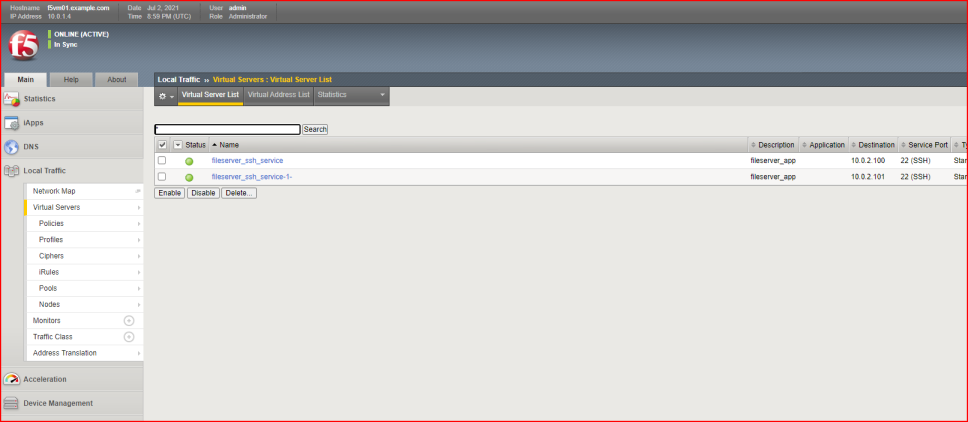
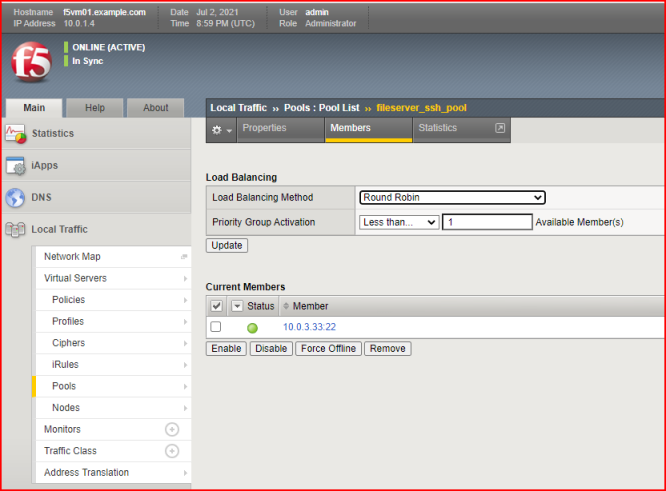

# SSH Server App
Simple demo app to expose port 22 from K8s pod

This simple demo assumes you already have F5 CIS set up and functioning correctly to process Config Maps. 

* You will want to edit the file called ```config-map.yaml``` so that the IP address(es) match what you would like configured.
* You will also want to edit ```deployment.yaml``` to point to your own image.
* For demonstration purposes, the Kubernetes service is of type ClusterIP with port of 2222, but the targetPort of the service is 22 and the containerPort of the Pod is 22. This is for a specific customer demonstration.

After that, run
````
git clone https://github.com/mikeoleary/ssh-app-exposed.git
cd ssh-app-exposed
kubectl apply -f ns.yaml
kubectl apply -f deployment.yaml
kubectl apply -f service.yaml
kubectl apply -f config-map.yaml
````

Now you should see an application exposed on your BIG-IP:



With a pool member:



Thanks!
